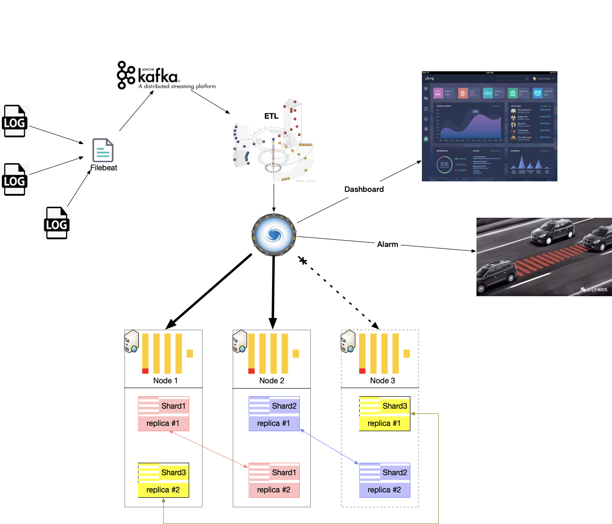

# 随行付统一监控平台

## 简介

随行付从12年至今，7年时间里从零至2万亿交易额，经历了多次数据风暴，系统架构经历了数次更迭；随着微服务架构被广泛用于生产，迫切需要一种，可以发现、解决微服务架构下监控治理的解决方案，因此统一监控平台应运而生。

**它的特点：**

1. 多，日处理TB级数据量，年PB以上的数据
2. 快，real-time 显示视图图表，真的很real-time
3. 好，支持Events、Metrics、JVM Graph、CPU MEM Graph、TPS&RPS Graph、Business Graph
4. 省，经济寒冬成本为王，这条最重要
5. 微服务架构下无缝兼容，接管微服务下的一体化监控
6. 规则引擎、告警通知，支持微信、SMS、Email、OpenChat、村口大喇叭
7. 无嵌入，不影响业务、NIAO么悄的就把数据归集起来
8. 自动服务发现
9. **发现性能瓶颈原因能力**
10. **发现内存溢出风险能力**

## 发展历程

### 2.0 基于Zabbix架构

### 3.0 基于ELK架构

随着数据量的增长，需要一种

#### ELK 架构图

#### 优势


好用


#### 问题


**巨额投入，10 \* （32U 128G）+ PB 总价\*\*W+ ，有钱也不能这么花，何况资本寒冬**


### 4.0 现在的方案

#### Features

1. 多，日处理TB级数据量，年PB以上的数据
2. 快，real-time 显示视图图表，真的很real-time
3. 好，支持 Events、Metrics、JVM Graph、CPU MEM Graph、TPS&RPS Graph、Business Graph
4. 省，经济寒冬成本为王，这条最重要
5. 向下兼容，兼容过去的架构采集的数据分析
6. 规则引擎、告警通知，支持微信、SMS、Email、OpenChat、村口大喇叭
7. 无嵌入，不影响业务、NIAO么悄的就把数据归集起来
8. 自动服务发现
9. **发现性能瓶颈原因能力**
10. **发现内存溢出风险能力**

#### 现在的架构

## 现在的方案

### 我们的需求

* 小巧的采集端
  * 高可用 不可丢失数据
  * 低功耗 不可和业务系统抢资源
* ETL 聚合层
  * 高可用 数据落盘防丢失
  * 具备线性业务处理能力
  * 低功耗 低成本
  * 数据无积压
* 高效存储
  * 年PB存储能力
  * **实时分析能力（至少比ETL更强才可以）**
* 报表能力
  * 发现性能瓶颈原因能力
  * 发现内存溢出风险能力
* 接管微服务监控治理能力

### Behavior Collection 方案设计过程

* **采集方案选型：**

<table>
  <thead>
    <tr>
      <th style="text-align:left">&#x65B9;&#x6848;</th>
      <th style="text-align:left">&#x4F18;&#x52BF;</th>
      <th style="text-align:left">&#x52A3;&#x52BF;</th>
    </tr>
  </thead>
  <tbody>
    <tr>
      <td style="text-align:left"><b>Logstash</b>
      </td>
      <td style="text-align:left">
        
Multiple inputs

        
Serveral outputs

        
Lots of filters

        
Lots of plugins

        
&#x63D0;&#x53D6;&#x3001;&#x89E3;&#x6790;&#x3001;&#x7F13;&#x51B2;&#x548C;&#x4F20;&#x8F93;

      </td>
      <td style="text-align:left">
        
&#x786C;&#x4F24;&#x8D44;&#x6E90;&#x6D88;&#x8017;

        
&#x91CD;&#x542F;&#x4E22;&#x6570;&#x636E;

      </td>
    </tr>
    <tr>
      <td style="text-align:left"><b>Filebeat</b>
      </td>
      <td style="text-align:left">
        
&#x5927;&#x9053;&#x81F3;&#x7B80;&#xFF0C;&#x4EE3;&#x7801;&#x5C11;&#x72AF;&#x9519;&#x5C11;&#x1F602;

        
&#x4F4E;&#x529F;&#x8017; CPU MEM

        
&#x8BB0;&#x5F55;&#x8BFB;&#x53D6;&#x4F4D;&#x7F6E;&#xFF0C;&#x4E0D;&#x4E22;&#x6570;&#x636E;

      </td>
      <td style="text-align:left">&#x529F;&#x80FD;&#x5C11;&#x1F602;</td>
    </tr>
    <tr>
      <td style="text-align:left"><b>Logagent</b>
      </td>
      <td style="text-align:left">
        
Sematext &#x63D0;&#x4F9B;&#x7684;&#x4F20;&#x8F93;&#x5DE5;&#x5177;

        
&#x672C;&#x5730;&#x7F13;&#x51B2;&#xFF0C;&#x4E0D;&#x4E22;&#x6570;&#x636E;

        
&#x8131;&#x654F;

      </td>
      <td style="text-align:left">&#x529F;&#x80FD;&#x5C11;</td>
    </tr>
    <tr>
      <td style="text-align:left">&lt;b&gt;&lt;/b&gt;<a href="https://github.com/fluent/fluentd-benchmark/tree/master/one_forward"><b>Fluentd</b></a>&lt;b&gt;&lt;/b&gt;</td>
      <td
      style="text-align:left">
        
&#x521D;&#x8877;JSON&#x4F5C;&#x4E3A;&#x65E5;&#x5FD7;&#x8F93;&#x51FA;

        
&#x548C; Logstash&#x4E00;&#x6837;

        
Lots of plugins

        
&#x7F13;&#x51B2;&#x53EA;&#x5B58;&#x5728;&#x4E0E;&#x8F93;&#x51FA;&#x7AEF;

        
&#x5355;&#x7EBF;&#x7A0B;&#x6838;&#x5FC3;&#xFF0C;&#x5927;&#x8282;&#x70B9;&#x6027;&#x80FD;&#x53D7;&#x9650;

        </td>
        <td style="text-align:left">&#x786C;&#x4F24;&#x8D44;&#x6E90;&#x6D88;&#x8017;</td>
    </tr>
    <tr>
      <td style="text-align:left"><b>Logtail</b>
      </td>
      <td style="text-align:left">
        
&#x963F;&#x91CC;&#x4E91;&#x529B;&#x4F5C;

        
&#x5360;&#x7528;&#x8D44;&#x6E90;&#x5C11;

      </td>
      <td style="text-align:left">&#x7ED3;&#x5408;&#x963F;&#x91CC;&#x4E91;&#x65E5;&#x5FD7;&#x670D;&#x52A1;&#x4F7F;&#x7528;</td>
    </tr>
  </tbody>
</table>
从上图表结合我们的需求，得出结论

我们选择了 **Filebeat**👏，他具备我们【小巧采集端】的要求。


### Metrics Collection 方案设计方法

Metrics 采集域，使用简单，无需代码嵌入；通过注册中心自动发现微服务集群Application，然后采集各个App的metrics信息，我们采用一种取巧的形式，兼容prometheus exposer采集点，之所以这样考虑，因为它是_Google_ BorgMon监控系统的开源版本，在google 开源软件生态体系被良好的支持，如：K8S。

我们提供两种方式采集：

* Pull   Metrics 主采，按频次发起请求，采集数据点
* Push Metrics 被采，在App里主动向Push Gateway 发送测量数据

### **ETL 聚合层**

聚合层做实时数据融合，将Behavior&Metrics收集到缓冲层后，在ETL聚合层内做数据的清洗、转换、最后存储到 Events Storage&Time Series Storage中。

### Link Tracking Domain

敬请期待……

### Time Series Storage

时序存储引擎，负责存储采集到的Metrics数据；我们主要用到三种数据结构：

* **Counter** 
  * 计数器用于累计值计算
  * 例如：TPS，RPS，Error in Logs
  * 数值一直增加，只有重启之后才会被重置
* **Gauge**    
  * 常规数值变化，例如：JVM Stack，CPU、Memory
* **Histogram**
  * 直方图主要用于跟踪事件放生规模，例如：某请求的成功率 .95 .90 .50 发生规模

#### **数据规模**

        每秒一个点，每个点采集数种性能指标， 采集数百个微服务节点。每天处理量：11396\(每个点至少字节数\) \* 86400/5\(5秒一个采集一个点\) = 939MB \* 100\(app数量\) = 91GB。

**时序存储能力：**

* 无缝接管Prometheus
* 大数据存储能力
* 大数据实时分析能力

### Events Storage

事件存储引擎，存储采集来的 Events；

### Output Domain

输出域，目前支持JVM Graph、Thread Graph、CPU Graph、Events等；可通过仪表盘轻松分析任何时刻，发现JVM性能瓶颈的原因，找出内存溢出风险的能力。

#### Alarm 告警

将触发告警的系统指标，推送给该接收的人

## 未来的路

我们下一步要做的事：

* 智能监控，监控报告细化到解决方案级
* 支持容器，Docker、K8S、Rancher等容器内的事件采集
* 支持更多中间件监控
* 支持自定义仪表配置

## 总结

想知道我们的存储引擎是怎么做的吗，JOIN US。

